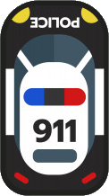

# Need For JS

### Подготовительный урок
[VS Code](https://code.visualstudio.com/ "Редактор кода")  
[Node.js](https://nodejs.org/ "Node.js")  
[Настройки JShint](https://jshint.com/docs/options/ "JShint")  

**Плагины для дальнейшей работы:**
- Auto Complete Tag
- Beautify
- Bracket Pair Colorizer
- Code Runner
- JavaScript Quick Console
- Import Cost
- Open in Browser
- Live Server

# 

### День первый
 

| Домашнее задание | Статус |
| --- | :---: |
| Повторить по видеоуроку за преподавателем   1. Создать страницу index.html   2. Подключить файл со стилями и javascript   3. Повторить код из урока   4. Прикрепить ссылку на архив в облаке или github репозиторий | :heavy_check_mark: |
| **`Дополнительное домашнее задание`**   Подобрать другую картинку для автомобиля |  |
