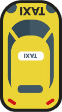
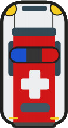

# Need For JS

### Подготовительный урок
[VS Code](https://code.visualstudio.com/ "Редактор кода")  
[Node.js](https://nodejs.org/ "Node.js")  
[Настройки JShint](https://jshint.com/docs/options/ "JShint")  

**Плагины для дальнейшей работы:**
- Auto Complete Tag
- Beautify
- Bracket Pair Colorizer
- Code Runner
- JavaScript Quick Console
- Import Cost
- Open in Browser
- Live Server

# 

### День первый
 

| Домашнее задание | Статус |
| --- | :---: |
| Повторить по видеоуроку за преподавателем   1. Создать страницу index.html   2. Подключить файл со стилями и javascript   3. Повторить код из урока   4. Прикрепить ссылку на архив в облаке или github репозиторий | :heavy_check_mark: |
| Подобрать другую картинку для автомобиля   **`* дополнительное домашнее задание`** |  |

# 

### День второй
 

| Домашнее задание | Статус |
| --- | :---: |
| Повторить по видеоуроку за преподавателем   1. Реализовать дорогу   2. Реализовать траффик автомобилей   3. Прикрепить ссылку на архив в облаке или github репозиторий | :heavy_check_mark: |
| Подобрать другую картинку для автомобилей **enemy**   **`* дополнительное домашнее задание`** |  |

# 

### День третий
 

| Домашнее задание | Статус |
| --- | :---: |
| **Обязательное:**   1. Повторить код из урока   2. Завершить приложение без ошибок и логов   3. Прикрепить ссылку на архив в облаке или github репозиторий | :heavy_check_mark: |
| **Дополнительное:**   1. В объект keys не должно добавляться новых свойств   2. Добавить музыку (с управлением или без)   3. Рандомные текстуры для трафика   4. Добавить уровни сложности (легкий, средний, сложный)   5. LocalStorage для рекорда, уведомлять об улучшении рекорда | :heavy_check_mark: |
| Дополнительная текстура для трафика |  |
